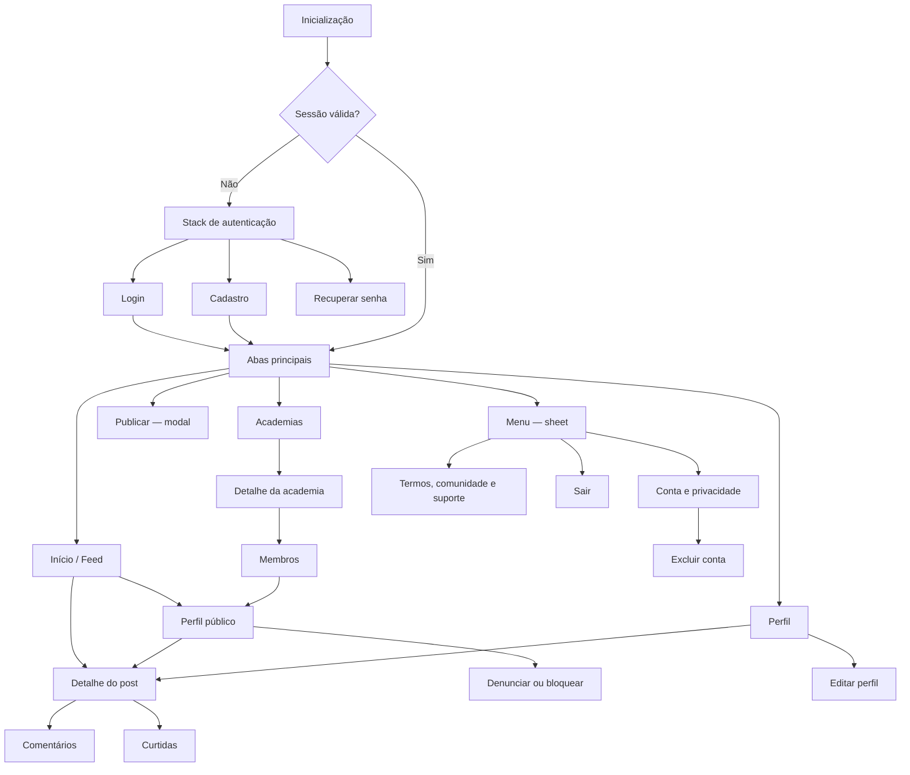

# Fase 0 — Definição de produto e UX mobile

> Baseline de produto autorizada em 25 de agosto de 2026.  
> Estado: concluída para início da fundação técnica.  
> Revisão obrigatória: antes do beta público e sempre que o escopo do MVP mudar.

## 1. Resultado da fase

A primeira versão do aplicativo OnlyFrangos será um cliente nativo para Android e iOS, focado na
experiência da comunidade. Ela terá o mesmo domínio e identidade visual da web, mas navegação e
interações próprias de dispositivos móveis.

Esta baseline fecha as decisões necessárias para iniciar `apps/mobile`. Cadastros nas lojas,
políticas publicadas e operação de moderação continuam como pré-requisitos organizacionais do beta,
sem bloquear o bootstrap técnico.

## 2. Público e proposta de valor

### Público inicial

- pessoas no Brasil que praticam musculação ou outros esportes;
- pessoas que desejam registrar evolução, compartilhar treinos e conhecer a comunidade local;
- idade mínima proposta para o beta público: 18 anos;
- idioma inicial: português do Brasil;
- território inicial: Brasil.

A API e a web atualmente aceitam cadastro a partir de 13 anos. Antes do beta público, a política
etária deve ser unificada em todas as plataformas. A baseline de 18 anos reduz o risco de tratar
dados, conteúdo social e informações fitness de menores sem uma operação específica de proteção.

### Proposta de valor

> Compartilhar a evolução fitness, acompanhar pessoas e encontrar academias em uma comunidade
> brasileira feita para quem treina.

### Objetivos do MVP

1. Tornar feed, publicação e perfil confortáveis para uso frequente no celular.
2. Permitir que uma conta complete a jornada social principal sem depender da web.
3. Oferecer controles mínimos de segurança, privacidade e moderação para conteúdo público.
4. Validar estabilidade e retenção com um beta pequeno antes de adicionar novas áreas sociais.

### Não objetivos

- reproduzir a interface desktop em uma tela pequena;
- levar funções administrativas para o aplicativo;
- lançar mensagens, notificações, desafios, rankings ou vídeo no primeiro release;
- substituir a API atual ou criar um backend independente para o mobile;
- monetização, anúncios, assinatura ou compra dentro do aplicativo no MVP.

## 3. Decisões fechadas

| Tema                    | Decisão                                                                                       |
| ----------------------- | --------------------------------------------------------------------------------------------- |
| Plataformas             | Android e iOS desde o beta fechado                                                            |
| Compatibilidade inicial | Android 7+ e iOS 16.4+, alinhados ao Expo SDK estável atual; revalidar ao criar o app         |
| Nome exibido            | OnlyFrangos                                                                                   |
| Slug e scheme           | `onlyfrangos`                                                                                 |
| Identificador proposto  | `com.onlyfrangos.app` em Android e iOS; validar disponibilidade nas contas das lojas          |
| Orientação              | Retrato no MVP; tablet deve permanecer utilizável sem layout dedicado                         |
| Tema                    | Escuro fixo no MVP, preparado para temas futuros                                              |
| Idioma                  | `pt-BR`                                                                                       |
| Cadastro                | Disponível no aplicativo, com aceite de termos e política de privacidade                      |
| Idade                   | 18+ na baseline do beta público; alinhar API e web antes do lançamento                        |
| Origem de mídia         | Galeria e câmera no MVP                                                                       |
| Deep links              | HTTPS em `onlyfrangos.com` mais scheme `onlyfrangos://`                                       |
| Telemetria proposta     | Sentry para crashes/desempenho com scrubbing; nenhum analytics comportamental no beta inicial |
| Administração           | Exclusiva da web                                                                              |
| Publicação              | TestFlight e faixa de teste fechada do Google Play antes de produção                          |

A documentação oficial atual do Expo informa suporte a Android 7+ e iOS 16.4+ no SDK estável mais
recente. A versão exata do SDK será fixada no bootstrap, nunca em canal canary ou beta.

## 4. Escopo funcional aprovado

### Conta e acesso

- splash e restauração segura de sessão;
- login, cadastro, logout e tratamento de sessão expirada;
- recuperação de senha por link seguro;
- aceite versionado de termos e política no cadastro;
- exclusão da própria conta dentro do aplicativo, com confirmação e nova autenticação quando
  necessário;
- acesso fácil à política de privacidade, termos, diretrizes da comunidade e suporte.

### Feed e publicações

- feed cronológico com cursor, pull to refresh e estados offline;
- cards com autor, data, legenda, imagens e contadores;
- criação com uma a quatro imagens da câmera ou galeria;
- reordenação, compressão, progresso e recuperação de falha no upload;
- edição e exclusão de publicação própria;
- like/unlike e lista de curtidas;
- comentários, respostas, likes em comentários e exclusão permitida.

### Perfis e relações

- perfil próprio e público;
- grid e detalhe de publicações;
- seguir e deixar de seguir;
- editar avatar, dados de perfil e preferências de privacidade;
- bloquear e desbloquear usuário;
- conteúdo de pessoas bloqueadas deixa de ser exibido nos dois sentidos definidos pelo contrato.

### Academias

- lista paginada e filtros por nome, estado e cidade;
- detalhe da academia e membros;
- associação da academia durante edição do próprio perfil.

### Confiança e segurança

- denunciar publicação, comentário e usuário;
- bloquear usuários por ação explícita;
- filtro de conteúdo proibido antes da publicação, com resposta compreensível;
- termos que definem conteúdo e condutas proibidos;
- fila administrativa de denúncias na web, trilha de auditoria e processo de resposta;
- contato de suporte publicado e acessível dentro do app;
- solicitação e execução da exclusão de conta e dados associados.

Os controles de denúncia, bloqueio, filtragem e operação de moderação são parte do MVP. Aplicativos
com conteúdo gerado pelo usuário precisam desses mecanismos para atender às políticas atuais da
[Apple](https://developer.apple.com/app-store/review/guidelines/#user-generated-content) e do
[Google Play](https://support.google.com/googleplay/android-developer/answer/9876937).

## 5. Mapa de navegação



### Regras de navegação

- as quatro áreas persistentes são Início, Academias, Publicar e Perfil; Menu é uma quinta ação;
- Publicar abre modal e retorna à tela anterior ao concluir ou cancelar;
- perfis públicos, posts e academias são telas empilhadas sobre as abas;
- comentários e curtidas começam como telas completas para favorecer teclado e acessibilidade;
- ações contextuais abrem bottom sheet; confirmação destrutiva nunca ocorre com um único toque;
- deep link autenticado preserva o destino durante login e continua para ele após autenticação;
- deep link de conteúdo removido mostra estado indisponível, sem loop de navegação;
- o gesto e botão de voltar seguem a pilha nativa de cada plataforma.

## 6. Wireframes de baixa fidelidade

Os wireframes validam hierarquia, ações e transições. Cores, espaçamento e tipografia finais serão
fechados no design system da Fase 1.

### 6.1 Login e cadastro

```text
┌──────────────────────────┐
│                          │
│      ONLYFRANGOS         │
│ Treine. Compartilhe.     │
│ Evolua.                  │
│                          │
│ E-mail                   │
│ ┌──────────────────────┐ │
│ └──────────────────────┘ │
│ Senha                ◉   │
│ ┌──────────────────────┐ │
│ └──────────────────────┘ │
│ Esqueci minha senha      │
│                          │
│ [        ENTRAR        ] │
│                          │
│ Não tem conta? Cadastre  │
└──────────────────────────┘

Cadastro: dados pessoais → localização → credenciais e aceite → confirmação.
```

### 6.2 Feed

```text
┌──────────────────────────┐
│ OnlyFrangos         busca│
├──────────────────────────┤
│ ◯ @maromba        •••    │
│ há 12 min                 │
│ ┌──────────────────────┐ │
│ │                      │ │
│ │       IMAGEM         │ │
│ │                  1/3 │ │
│ └──────────────────────┘ │
│ ♡ 128   comentário    ↗  │
│ Treino de pernas feito!  │
│ Ver 14 comentários       │
├──────────────────────────┤
│ ◯ próximo post...        │
├──────────────────────────┤
│ Início Academia ＋ Perfil│
│                 Menu     │
└──────────────────────────┘
```

### 6.3 Criar publicação

```text
┌──────────────────────────┐
│ Cancelar  Nova publicação│
│                          │
│ ┌────────┐ ┌────────┐    │
│ │ foto 1 │ │ foto 2 │ ＋  │
│ └────────┘ └────────┘    │
│ Arraste para reordenar   │
│                          │
│ Legenda                  │
│ ┌──────────────────────┐ │
│ │ Compartilhe o treino │ │
│ │                      │ │
│ └──────────────────────┘ │
│ 0/limite                 │
│                          │
│ [       PUBLICAR       ] │
└──────────────────────────┘
```

### 6.4 Perfil público

```text
┌──────────────────────────┐
│ ‹  @extrastickersbr  ••• │
├──────────────────────────┤
│      ◯  Nome             │
│      bio do perfil       │
│ 42 posts  1,2 mil  318   │
│           seguidores     │
│ [ SEGUIR ] [ MENSAGEM* ] │
│ Academia • Cidade        │
│ Objetivo • Peso público  │
├──────────────────────────┤
│ PUBLICAÇÕES              │
│ ┌──────┬──────┬──────┐   │
│ │      │      │      │   │
│ ├──────┼──────┼──────┤   │
│ │      │      │      │   │
│ └──────┴──────┴──────┘   │
└──────────────────────────┘
* Mensagens não aparecem no MVP.
```

### 6.5 Academias

```text
┌──────────────────────────┐
│ Academias                │
│ ┌──────────────────────┐ │
│ │ Buscar por nome      │ │
│ └──────────────────────┘ │
│ [Estado] [Cidade]        │
│ ┌──────────────────────┐ │
│ │ IMAGEM  Academia A   │ │
│ │         Fortaleza/CE │ │
│ │         83 membros   │ │
│ └──────────────────────┘ │
│ ┌──────────────────────┐ │
│ │ IMAGEM  Academia B   │ │
│ └──────────────────────┘ │
├──────────────────────────┤
│ Início Academia ＋ Perfil│
│                 Menu     │
└──────────────────────────┘
```

### 6.6 Menu e segurança

```text
┌──────────────────────────┐
│        MENU              │
│ @usuario                 │
├──────────────────────────┤
│ Editar perfil          › │
│ Conta e privacidade    › │
│ Usuários bloqueados    › │
│ Diretrizes comunidade  › │
│ Termos e privacidade   › │
│ Ajuda e suporte        › │
├──────────────────────────┤
│ Sair                     │
└──────────────────────────┘

Menu contextual de conteúdo:
┌──────────────────────────┐
│ Denunciar publicação     │
│ Bloquear @usuario        │
│ Cancelar                 │
└──────────────────────────┘
```

## 7. Fluxos críticos e critérios de aceite

### Autenticação e retorno

1. O app tenta restaurar a sessão sem exibir rapidamente a tela de login.
2. Sem sessão válida, abre login; cadastro e recuperação são rotas adjacentes.
3. Depois do login, abre o destino preservado ou o feed.
4. Se o refresh falhar, limpa os tokens e volta ao login com mensagem não técnica.

**Aceite:** fechar e reabrir o app restaura uma sessão válida; uma sessão revogada nunca entra em
loop de refresh.

### Criar publicação

1. A pessoa abre Publicar e escolhe câmera ou galeria.
2. O sistema pede a permissão somente nesse momento.
3. Ela revisa, reordena, remove, escreve a legenda e envia.
4. O app exibe progresso e impede envio duplicado.
5. Sucesso insere o post no topo; falha preserva o rascunho e permite tentar novamente.

**Aceite:** a publicação não duplica com toque repetido, interrupção de rede não apaga o rascunho
e a interface informa o estado para leitor de tela.

### Denunciar e bloquear

1. O menu contextual oferece ações separadas e claramente rotuladas.
2. Denúncia pede categoria, detalhe opcional e confirmação.
3. Bloqueio explica o efeito antes de confirmar.
4. O conteúdo bloqueado desaparece e a relação de follow é encerrada conforme regra da API.
5. A equipe recebe a denúncia na fila administrativa com prazo e trilha de ação.

**Aceite:** post, comentário e usuário podem ser denunciados dentro do app; bloquear e desbloquear
produz o mesmo resultado após reiniciar o aplicativo.

### Excluir conta

1. Conta e privacidade mostra Excluir conta em área destrutiva.
2. A tela explica dados removidos, possíveis retenções legais e irreversibilidade.
3. A pessoa confirma digitando o username e se autentica novamente quando exigido.
4. A API revoga sessões, agenda/executa exclusão e retorna comprovante não sensível.
5. O app apaga armazenamento local e volta ao acesso.

**Aceite:** a opção é fácil de encontrar, inicia a exclusão dentro do app e remove os dados que não
precisam ser legalmente mantidos. Apple e Google exigem caminhos de exclusão para aplicativos que
permitem criar contas: [orientação da Apple](https://developer.apple.com/support/offering-account-deletion-in-your-app/)
e [orientação do Google Play](https://support.google.com/googleplay/android-developer/answer/13327111).

## 8. Requisitos de privacidade, termos e operação

### Política de privacidade

Deve estar em URL pública, dentro do aplicativo e nas lojas, cobrindo:

- controlador, contato e canal de suporte/privacidade;
- dados de conta, perfil, localização declarada, conteúdo, mídia e dados fitness;
- finalidades, base aplicável, retenção e exclusão;
- fornecedores, subprocessadores e transferências;
- segurança, direitos da pessoa e forma de exercê-los;
- telemetria e dados coletados pelos SDKs;
- política etária e mudanças futuras.

As lojas exigem declarações coerentes também para SDKs terceiros. Ver
[App Privacy da Apple](https://developer.apple.com/app-store/app-privacy-details/) e
[Data safety do Google Play](https://support.google.com/googleplay/android-developer/answer/10787469).

### Termos e diretrizes da comunidade

O cadastro deve registrar versão e data de aceite. Termos/diretrizes devem proibir ao menos:

- assédio, ameaça, bullying e discurso de ódio;
- nudez ou conteúdo sexual proibido;
- exploração de menores;
- fraude, spam, impersonação e promoção enganosa;
- violação de direitos autorais ou privacidade;
- orientação de saúde perigosa apresentada como diagnóstico;
- uso da plataforma para atividades ilegais.

### Operação de moderação

- fila administrativa na web com estado, categoria, prioridade, responsável e histórico;
- contato de suporte publicamente acessível;
- triagem inicial de denúncia em até 24 horas durante o beta;
- remoção, advertência, suspensão e bloqueio com motivos auditáveis;
- processo de recurso e retenção mínima de evidência;
- filtro preventivo simples mais revisão humana; automação nunca decide sanção irreversível sozinha.

## 9. Métricas e gates do beta

| Dimensão                        | Meta inicial                                    | Gate para produção                                |
| ------------------------------- | ----------------------------------------------- | ------------------------------------------------- |
| Sessões sem crash               | ≥ 99,5%                                         | Pelo menos sete dias de beta                      |
| Inicialização até conteúdo útil | p75 ≤ 2,5 s em abertura fria                    | Medido em aparelho intermediário e rede estável   |
| Feed inicial                    | p75 ≤ 2,0 s após sessão pronta em 4G estável    | Inclui primeira imagem visível                    |
| Login/restauração               | ≥ 98% sem falha não atribuída a credencial/rede | Sem loop de refresh                               |
| Upload de publicação            | ≥ 95% de sucesso em rede estável                | Sem duplicação e com rascunho recuperável         |
| Jornada E2E crítica             | 100% passando                                   | Android e iOS                                     |
| Acessibilidade                  | zero bloqueador conhecido                       | Leitor de tela e fonte ampliada verificados       |
| Moderação                       | 100% das denúncias triadas em até 24 h no beta  | Responsável e escala definidos                    |
| Segurança                       | zero vulnerabilidade crítica/alta aberta        | Revisão de sessão, autorização e upload concluída |

Não há analytics de engajamento no primeiro beta. A instrumentação fica restrita a crashes,
desempenho técnico e contadores agregados indispensáveis aos gates acima.

## 10. Critérios de sucesso da Fase 0

- [x] MVP e itens fora de escopo definidos.
- [x] Android e iOS definidos como plataformas do beta.
- [x] Nome, identificadores propostos, idioma, tema e orientação definidos.
- [x] Mapa de navegação e regras de transição documentados.
- [x] Wireframes de baixa fidelidade dos fluxos principais produzidos.
- [x] Privacidade, termos, moderação, suporte e exclusão identificados como requisitos.
- [x] Backlog priorizado com critérios de aceite criado.
- [x] Métricas e gates do beta definidos.

## 11. Pendências organizacionais que não bloqueiam a Fase 1

- reservar `com.onlyfrangos.app` nas contas Apple e Google;
- definir a organização proprietária das contas Apple, Google, Expo e Sentry;
- publicar política de privacidade, termos, diretrizes da comunidade e página de exclusão;
- escolher e publicar e-mail/URL de suporte;
- nomear responsáveis e escala da moderação;
- obter revisão jurídica da política etária e dos documentos públicos;
- alinhar a idade mínima de cadastro entre API, web e mobile antes do beta público.

Essas pendências bloqueiam o beta externo ou a produção caso permaneçam abertas.
